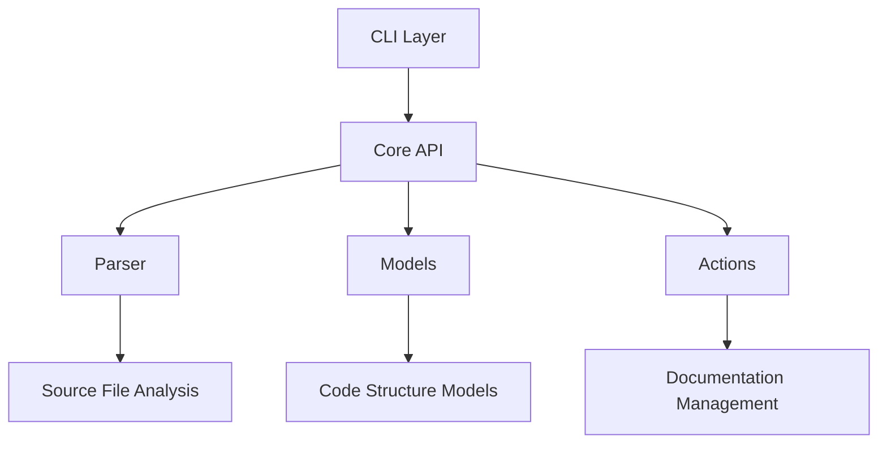
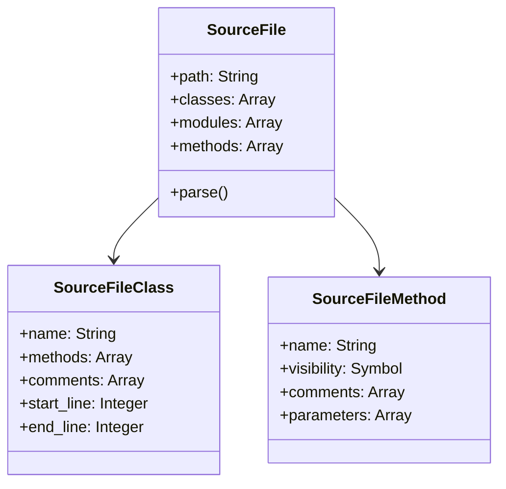
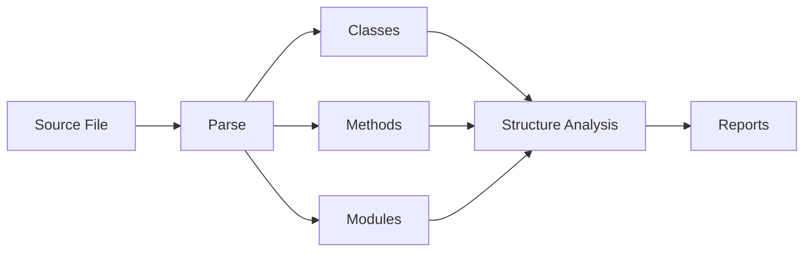

# Metimur

A powerful Ruby source code analysis and documentation management tool.

 <!-- You'd need to create/add this -->

## What is Metimur?

Metimur is a Ruby library and command-line tool that helps developers analyze, document, and maintain Ruby source code. It provides capabilities to:

- Parse Ruby source files and extract structural information
- Add or update documentation comments for classes, modules, and methods
- Manage file header and footer comments
- Generate code structure reports
- Read and update YARD-style documentation programatically

## Table of Contents

- [Installation](#installation)
- [Quick Start](#quick-start)
- [Architecture](#architecture)
- [Usage Examples](#usage-examples)
  - [Command Line Interface](#command-line-interface)
  - [Ruby API](#ruby-api)
- [Documentation Management](#documentation-management)
- [Code Analysis](#code-analysis)
- [Contributing](#contributing)
- [License](#license)

## Installation

Add this line to your application's Gemfile:

```ruby
gem 'metimur'
```

Then execute:

```bash
$ bundle install
```

Or install it directly:

```bash
$ gem install metimur
```

## Quick Start

### 1. Analyze a Ruby File

```bash
# Parse a single Ruby file
metimur parse-file lib/my_class.rb

# Parse with JSON output
metimur parse-file lib/my_class.rb --format=json

# Show detailed information
metimur parse-file lib/my_class.rb --details
```

### 2. Add Documentation

```bash
# Add a YARD comment to a class
metimur set-class-comment lib/my_class.rb MyClass "@author John Doe\n@since 1.0.0"

# Add a method comment
metimur set-method-comment lib/my_class.rb my_method "@param name [String] The user's name\n@return [Boolean] Success status"
```

## Architecture

Metimur is built with a modular architecture that separates concerns into distinct components:



### Component Breakdown



## Usage Examples

### Command Line Interface

1. **Parse a Ruby File**

```bash
$ metimur parse-file lib/user.rb
File: lib/user.rb
Total lines: 50

Classes (1):
  User (1..45)
    - initialize (5..8)
    - full_name (10..12)
    - save (14..20)
```

2. **Add Class Documentation**

```bash
$ metimur set-class-comment lib/user.rb User "User model representing system users
@author John Doe
@since 1.0.0"
```

### Ruby API

1. **Parse a Source File**

```ruby
require 'metimur'

# Parse a single file
source_file = Metimur.parse_file('lib/user.rb')

# Access file information
puts "Classes found: #{source_file.classes.count}"
source_file.classes.each do |klass|
  puts "Class: #{klass.name}"
  puts "Methods: #{klass.methods.map(&:name).join(', ')}"
end
```

2. **Manage Documentation**

```ruby
require 'metimur'

# Add a YARD comment to a method
Metimur.set_yard_comment(
  'lib/user.rb',
  15, # line number
  "@param name [String] The user's name\n@return [User] The created user"
)

# Add a file header
Metimur.set_file_header_comment(
  'lib/user.rb',
  "Copyright (c) 2023 Your Company\nLicensed under MIT"
)
```

## Documentation Management

Metimur supports multiple documentation styles:

### YARD Style

```ruby
# @param name [String] The user's name
# @param age [Integer] The user's age
# @return [User] The created user instance
# @raise [ValidationError] If parameters are invalid
def create_user(name, age)
  # Implementation
end
```

### Plain Comments

```ruby
# Creates a new user with the given name and age.
# Raises ValidationError if parameters are invalid.
def create_user(name, age)
  # Implementation
end
```

## Code Analysis

Metimur provides detailed code analysis capabilities:



### Analysis Features

- Method complexity analysis
- Class hierarchy mapping
- Documentation coverage
- Code structure visualization

## Contributing

We welcome contributions! Here's how you can help:

1. Fork the repository
2. Create your feature branch (`git checkout -b feature/amazing-feature`)
3. Make your changes
4. Run the tests (`bundle exec rspec`)
5. Commit your changes (`git commit -am 'Add amazing feature'`)
6. Push to the branch (`git push origin feature/amazing-feature`)
7. Create a Pull Request

### Development Setup

```bash
# Clone the repository
git clone https://github.com/yourusername/metimur.git

# Install dependencies
cd metimur
bundle install

# Run tests
bundle exec rspec

# Run the local version
bundle exec exe/metimur
```

## License

This project is licensed under the MIT License - see the [LICENSE.md](LICENSE.md) file for details.

## Support

Need help? Have questions?

- Create an issue: [https://github.com/yourusername/metimur/issues](https://github.com/yourusername/metimur/issues)
- Email: support@metimur.example.com
- Documentation: [https://metimur.example.com/docs](https://metimur.example.com/docs)

---

Made with ❤️ by the Metimur team
